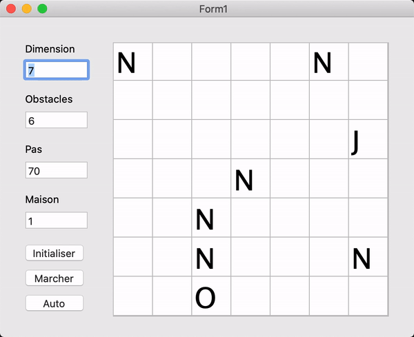

# Ivrogne

Ivrogne is a tiny high school project written in Pascal. The player first configures a board of size _n x n_ with a number _m_ of obstacles, a house and a drunk. Obstacles are represented by the letter `N`, the drunk by the letter `J`, and the house by the letter `O`. The goal is to get the drunk back to his house by advancing in a random direction each time, avoiding obstacles.

